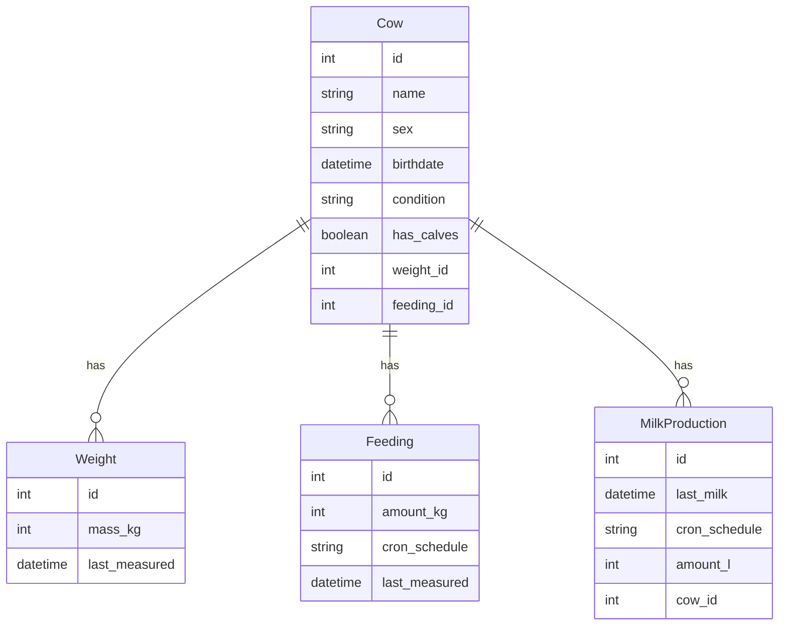
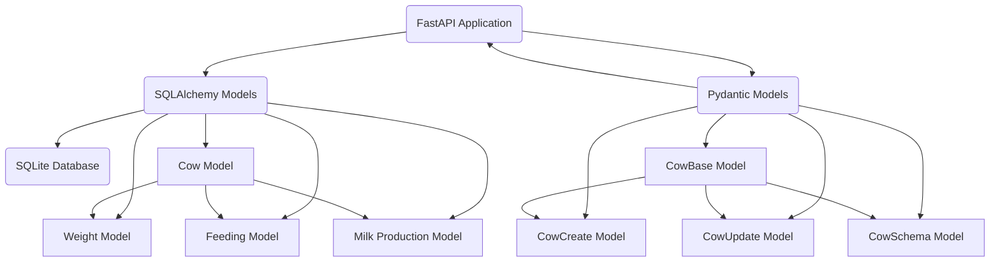

# Cowshed Management API

This is a FastAPI application that provides CRUD (Create, Read, Update, Delete) operations for managing cows and their associated attributes such as weight, feeding, and milk production.

## Backend
The backend of the system is built with FastAPI, a modern, fast (high-performance), web framework for building APIs with Python 3.6+ based on standard Python type hints. FastAPI is built on top of Starlette for the web parts and Pydantic for the data parts.

The backend provides a set of endpoints for managing cows, including endpoints for creating a new cow, retrieving all cows, retrieving a specific cow by its id, updating a specific cow, and deleting a specific cow.

Database
The system uses SQLite for data storage. SQLAlchemy, a SQL toolkit and Object-Relational Mapping (ORM) system for Python, is used to interact with the database.

## Project structure

```
.
├── .env  # Environment variables such as the `DATABASE_URL`
├── setup.py  # Used to distribute your Python package. It contains metadata about your package
├── MANIFEST.in  # Used to include non-python files in your package
├── README.md  # Information about your project and how to use it
├── LICENSE  # The license for your project
├── main.py  # The main file of the application. It contains the FastAPI application, the Pydantic and SQLAlchemy models, and the routes for the CRUD operations
├── requirements.txt  # Lists the Python packages that the application depends on
├── requirements-dev.txt  # Lists the Python packages that are needed for development
├── models
│   ├── __init__.py
│   ├── cow.py  # SQLAlchemy model for a Cow
│   ├── feeding.py  # SQLAlchemy model for a Feeding
│   ├── milk_production.py  # SQLAlchemy model for MilkProduction
│   └── weight.py  # SQLAlchemy model for a Weight
├── schemas
│   ├── __init__.py
│   ├── cow_schema.py  # Pydantic schema for representing Cow data
│   ├── feeding_schema.py  # Pydantic schema for representing Feeding data
│   ├── milk_production_schema.py  # Pydantic schema for representing MilkProduction data
│   └── weight_schema.py  # Pydantic schema for representing Weight data
├── database
│   ├── __init__.py
│   └── session.py  # Contains the database session and engine setup
├── routes
│   ├── __init__.py
│   └── cow.py  # Contains the routes for the CRUD operations for a Cow
└── tests
    ├── __init__.py
    └── test_main.py  # Contains tests for the FastAPI application defined in main.py. The tests cover the CRUD operations for a Cow object and its associated Weight, Feeding, and MilkProduction objects.
```
## Features

- Create a new cow with associated weight, feeding, and milk production data.
- Retrieve all cows or a specific cow by its ID.
- Update a specific cow and its associated data.
- Delete a specific cow.
- Filter cows by sex.

## Diagrams

### Entity-Relationship Diagram (ERD)



This is an Entity-Relationship Diagram (ERD) that represents the relationships between different entities (or tables) in a database. In this case, the entities are `Cow`, `Weight`, `Feeding`, and `MilkProduction`.

Here's a breakdown of the diagram:

- `Cow`, `Weight`, `Feeding`, and `MilkProduction` are entities. Each entity has attributes. For example, the `Cow` entity has attributes like `id`, `name`, `sex`, `birthdate`, `condition`, `has_calves`, `weight_id`, and `feeding_id`.

- The `||--o{` notation represents a one-to-many relationship. In this case, a `Cow` can have multiple `Weight`, `Feeding`, and `MilkProduction` records. The `Cow` is on the "one" side of the relationship, and `Weight`, `Feeding`, and `MilkProduction` are on the "many" side.

- The `has` label on the relationships indicates that a `Cow` "has" `Weight`, `Feeding`, and `MilkProduction` records.

- The `weight_id` and `feeding_id` attributes in the `Cow` entity are likely foreign keys that link to the `id` in the `Weight` and `Feeding` entities, respectively. Similarly, the `cow_id` attribute in the `MilkProduction` entity is likely a foreign key that links to the `id` in the `Cow` entity.

### Component Diagram




In this diagram, the FastAPI application interacts with both the Pydantic models and the SQLAlchemy models. The SQLAlchemy models interact with the SQLite database. The Pydantic models are used to validate and serialize the data that is sent to and received from the FastAPI application.

The SQLAlchemy models include `Weight`, `Feeding`, `Cow`, and `MilkProduction`. The Pydantic models include `CowBase`, `CowCreate`, `CowUpdate`, and `CowSchema`. The `CowBase` model is the base model for the `CowCreate`, `CowUpdate`, and `CowSchema` models.

The `Cow` model in SQLAlchemy has relationships with the `Weight`, `Feeding`, and `MilkProduction` models.

## Models

The application uses Pydantic and SQLAlchemy models to handle data validation and database operations respectively.

### Pydantic Models

- `WeightBase`: Contains mass in kg and the date when the weight was last measured.
- `FeedingBase`: Contains amount in kg, cron schedule for feeding, and the date when the feeding was last measured.
- `MilkProductionBase`: Contains the date and time of the last milk production, cron schedule for milk production, and the amount of milk produced in liters.
- `CowBase`: Contains the cow's name, sex, birthdate, condition, boolean value indicating if the cow has calves, and the associated weight, feeding, and milk production data.
- `CowCreate`: Inherits from `CowBase` and includes a validator to ensure that male cows cannot have calves or produce milk.
- `CowUpdate`: Inherits from `CowBase` and includes a validator to ensure that male cows cannot have calves or produce milk.
- `CowSchema`: Inherits from `CowBase` and includes an ID attribute.

### SQLAlchemy Models

- `Weight`: Contains the weight's ID, mass in kg, and the date when the weight was last measured.
- `Feeding`: Contains the feeding's ID, amount in kg, cron schedule for feeding, and the date when the feeding was last measured.
- `Cow`: Contains the cow's ID, name, sex, birthdate, condition, boolean value indicating if the cow has calves, and foreign keys to the weight, feeding, and milk production tables. It also establishes relationships with the `Weight`, `Feeding`, and `MilkProduction` models.
- `MilkProduction`: Contains the milk production's ID, the date of the last milk production, cron schedule for milk production, and the amount of milk produced in liters.

## Environment Variables

The application uses the following environment variables:

- `DATABASE_URL`: The URL of the database to connect to.

You need to create a `.env` file in the root directory of the project and add the `DATABASE_URL` variable to it. Here is an example of what the `.env` file should look like:

```
DATABASE_URL=sqlite:///./sql_app.db
```

Replace `sqlite:///./sql_app.db` with the URL of your actual database.

## Endpoints

- `POST /cows`: Create a new cow.
- `GET /cows`: Retrieve all cows.
- `GET /cows/{cow_id}`: Retrieve a specific cow by its ID.
- `GET /cows/sex/{sex}`: Retrieve all cows that match the provided sex.
- `PUT /cows/{cow_id}`: Update a specific cow.
- `DELETE /cows/{cow_id}`: Delete a specific cow.

## Running the Application

To run the application, you need to have Python installed on your machine. You can then install the required dependencies and start the application as follows:

1. Install the wheel file:

```bash
pip install cowshed_api-0.1-py3-none-any.whl
```

2. Start the application:

```bash
uvicorn app.main:app --reload
```

The application will be available at `http://localhost:8000`.

## Testing

### Unit & Integration tests

You can test the application using the interactive Swagger UI API documentation which is available at `http://localhost:8000/docs` when the application is running.

Alternatively you can test the application using the interactive ReDoc API documentation which is available at `http://localhost:8000/redocs` when the application is running.

The application also includes a suite of tests to ensure that all endpoints work as expected. The tests are written using pytest, a testing framework for Python. The tests cover the CRUD operations for a Cow object and its associated Weight, Feeding, and MilkProduction objects.

## Load Testing FastAPI Application

To load test a FastAPI application, we can use a tool like Locust. Here are the steps:

1. **Install Locust**: You can install Locust using pip:

    ```bash
    pip install locust
    ```

2. **Create a Locust file**: Create a `locustfile.py` with the following content:

    ```python
    from locust import HttpUser, task, between

    class WebsiteUser(HttpUser):
        wait_time = between(1, 2.5)

        @task
        def get_cows(self):
            self.client.get("/cows")

        @task
        def create_cow(self):
            self.client.post("/cows", json={
                "name": "Test Cow",
                "sex": "Female",
                "birthdate": "2022-01-01T00:00:00",
                "condition": "Healthy",
                "has_calves": False,
                "weight": {
                    "mass_kg": 500,
                    "last_measured": "2022-01-01T00:00:00"
                },
                "feeding": {
                    "amount_kg": 20,
                    "cron_schedule": "* * * * *",
                    "last_measured": "2022-01-01T00:00:00"
                }
            })
    ```

3. **Run your FastAPI application**: You need to have your FastAPI application running in order for Locust to send requests to it. You can typically run your FastAPI application locally using a command like:

    ```bash
    uvicorn main:app --reload
    ```

    Replace `main` with the name of your Python file (without the `.py` extension) and `app` with the name of your FastAPI application instance.

4. **Run Locust**: Run Locust with the following command:

    ```bash
    locust -f locustfile.py --host=http://localhost:8000
    ```

    Replace `"http://localhost:8000"` with the URL where your FastAPI application is running.

5. **Start the load test**: Open a web browser and go to `http://localhost:8089`. Enter the number of users to simulate and the hatch rate (how many users to start per second). Then click "Start swarming" to start the load test.

Remember to only run load tests against test or staging environments, not against your production environment.

### Load Test Results

#### Request Summary

| Type | Name | # reqs | # fails | Avg | Min | Max | Med | req/s | failures/s |
|------|------|--------|---------|-----|-----|-----|-----|-------|------------|
| GET  | /cows | 952 | 23(2.42%) | 1877 | 6 | 58974 | 150 | 5.60 | 0.14 |
| POST | /cows | 1072 | 45(4.20%) | 2802 | 14 | 60726 | 130 | 6.31 | 0.26 |
|      | Aggregated | 2024 | 68(3.36%) | 2367 | 6 | 60726 | 140 | 11.91 | 0.40 |

#### Response Time Percentiles

| Type | Name | 50% | 66% | 75% | 80% | 90% | 95% | 98% | 99% | 99.9% | 99.99% | 100% | # reqs |
|------|------|-----|-----|-----|-----|-----|-----|-----|-----|-------|--------|------|-------|
| GET  | /cows | 150 | 540 | 900 | 1100 | 2100 | 2800 | 30000 | 58000 | 59000 | 59000 | 59000 | 952 |
| POST | /cows | 130 | 800 | 1300 | 1900 | 3300 | 6800 | 57000 | 59000 | 60000 | 61000 | 61000 | 1072 |
|      | Aggregated | 140 | 650 | 1000 | 1400 | 2400 | 4100 | 32000 | 58000 | 59000 | 61000 | 61000 | 2024 |

#### Error Report

| # occurrences | Error |
|---------------|-------|
| 45 | POST /cows: HTTPError('500 Server Error: Internal Server Error for url: /cows') |
| 23 | GET /cows: HTTPError('500 Server Error: Internal Server Error for url: /cows') |

### Load Test Results Interpretation

#### Request Summary

The load test was performed by ramping ug one user per second up to 100 users total peak concurency.
The fastapi application was running locally on the following system:
- `Device`:	Microsoft Surface Book 3
- `Processor`:Intel(R) Core(TM) i7-1065G7 CPU @ 1.30GHz   1.50 GHz
- `RAM`: 32,0 GB (31,6 GB usable)
- `System type`:	64-bit operating system, x64-based processor

The GET requests to `/cows` had an average response time of 1877 milliseconds, with a minimum of 6 milliseconds and a maximum of 58974 milliseconds. The median response time was 150 milliseconds. There were about 5.60 requests per second, with about 0.14 failures per second. Out of 952 total requests, 23 failed, which is a failure rate of about 2.42%.

The POST requests to `/cows` had a slightly higher average response time of 2802 milliseconds, with a minimum of 14 milliseconds and a maximum of 60726 milliseconds. The median response time was 130 milliseconds. There were about 6.31 requests per second, with about 0.26 failures per second. Out of 1072 total requests, 45 failed, which is a failure rate of about 4.20%.

The aggregated statistics show the combined results for both GET and POST requests. The average response time was 2367 milliseconds, with a minimum of 6 milliseconds and a maximum of 60726 milliseconds. The median response time was 140 milliseconds. There were about 11.91 requests per second, with about 0.40 failures per second. Out of 2024 total requests, 68 failed, which is a failure rate of about 3.36%.

#### Response Time Percentiles

The 50% percentile (also known as the median) for GET requests to `/cows` was 150 milliseconds, which means that 50% of the requests had a response time of 150 milliseconds or less. The 95% percentile was 2800 milliseconds, which means that 95% of the requests had a response time of 2800 milliseconds or less.

#### Error Report

There were 45 occurrences of a 500 Server Error for POST requests to `/cows`, and 23 occurrences of the same error for GET requests to `/cows`. This indicates that the server was unable to handle some of the requests, possibly due to high load or a problem with the application code.

In general, these results suggest that the application may struggle to handle high load, especially for POST requests to `/cows`. The high maximum response times and the number of server errors indicate that there may be performance issues that need to be addressed.

  
